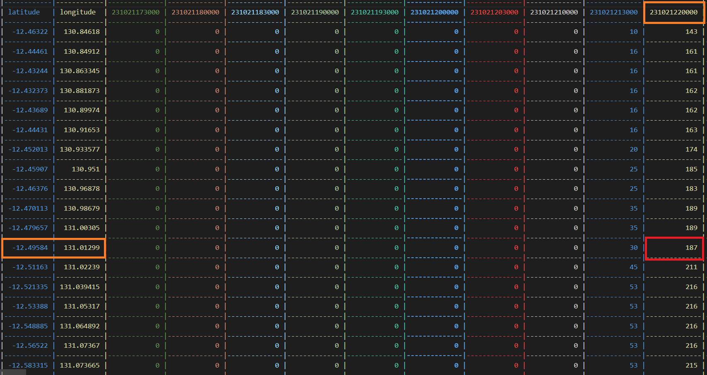

# Recruitment Sim

Your task is to write a simple race simulation that will output the optimal constant speed for the World Solar Challenge, a ~3000km race starting in Darwin, Australia and ending in Adelaide, Australia. Your primary goal is to fill in the code and complete the `Sim` class and the `Car` class.

# Description of the World Solar Challenge

- Seven day event starting on October 22nd, 2023 and ending on October 28th, 2023
- Race days mark the official hours during the day when cars are allowed to drive toward the finish line. On the first day (October 22nd, 2023), the race day begins at 10am and ends at 6pm. From the second day (October 23rd, 2023) onwards, the race day spans from 9am to 5pm.
- Outside of race hours, the car can be charged in a stationary position as long as the sun is above the horizon.
- There are 9 control stops at specific places throughout the race where you must stop for 30 minutes, allowing the car to charge and check in with race officials.
- The goal is to make it to the finish line in Adelaide as quickly as possible.

# Your Task

You have been given starter code for completing this assignment that can be found in the `include/` and `src/` folders. You will first need to complete the `Car` class which will model the energy state of the car when travelling at a constant speed between two points. At minimum, you will need to model aerodynamic energy loss, rolling resistance loss, gravitational loss, and passive electric loss. You'll be able to find equations for these from a quick google search. A list of constants are given below to aid in the formulation of those equations:

- Passive Electric Loss: 20 W
- Rolling Resistance Constant: 0.0026
- cda: 0.15
- Array Efficiency: 0.252
- Car Mass: 283kg
- Battery Efficiency: 0.98
- Motor Efficiency: 0.8
- Array Area: 4 m^2
- Maximum Battery Capacity: 5.2 kWh

You will also have to complete the `Sim` class which will take a `Car` object as input along with an array of route coordinates, and control stop locations. The `sim` class has one primary function called `run_sim` that will simulate whether a proposed constant speed is a viable solution for the race. It is viable if the energy level of the car never drops below 0.0 and if the car can make it to the end of the race by October 28th, 2023, 5pm. Your `run_sim` function should be calling functions from your `Car` class to calculate energy changes throughout the race. The `Sim.hpp` file already defines the series of constants e.g. race day start/end times that you can use.

There are two .csv files located in the `data/` folder - `baseroute.csv` and `dni.csv`

The baseroute.csv is the series of points in the route formatted into |latitude(deg) | longitude(deg) | altitude(m)| columns. 

The dni.csv is a lookup table that holds irradiance values (W/m^2) from the sun throughout the route. In this lookup table, you can access the irradiance value using a latitude/longitude and a timestamp combination where the latitude/longitude index the rows and the timestamps index the columns. The timestamps are formatted in a single string YYMMDDHHMMSS.



For example, if you want to know the irradiance value at a lat/long coordinate of -12.51163,131.02239 and timestamp of 2023-10-21 22:00:00, it would be 187 W/m^2 (highlighted in red). The coordinate indexes the 12th row and the timestamp indexes the 10th column. For timestamps or latitude/longitude values that aren't directly on the lookup table, linearly interpolate to the nearest row/column.

WARNING: All times in dni.csv are in UTC time, which is 9.5 hours behind Australian central time zone. Therefore, 2023/10/23 21:30:00 (231023213000 in dni.csv) actually means 2023/10/24 09:00:00 LOCAL Australian time. You will notice that in every instantiation of the Time class, there is a -9.5 argument to account for this UTC adjustment.

The `main.cpp` file is the entry point of your program. It loads in the series of route points from baseroute.csv, sets up a set of indices where control stops are located and loads the dni.csv . You should NOT modify these lines. Then, it instantiates an object of `Car` type which you will write, sets the starting time and starting coordinate of the simulation. Finally, it loops through speeds from 1 to 100 to determine which speeds allow the race to be completed by repeatedly calling the `run_sim()` function that you will write. You should not need to modify the `Luts.hpp` file and `date.h` files at all. You should not have to read the `date.h` file at all; it is a third party package written by other people. You should not have to modify anything in main.cpp.

You will have to take a read through the code to understand how it interacts before beginning your implementation. The instructions are kept vague to encourage you to think critically about your implementation. I recommend starting with the Car class and specifically listing out the equations that will model energy losses and energy gains.

# Toolchain and Build

This section is for those who do not already have the necessary dependencies for this project (CMake, git, make, gcc). If you already have these applications instealled, you can skip to the next section.

## Windows
The recommended toolchain for Windows is MSVC, but any other toolchain will also work fine e.g. Mingw, Clang/LLVM
1. Download Visual Studio from https://visualstudio.microsoft.com/downloads/ and download the "Desktop Development with C++" package after launching the installer

From the installed x64 Native Tools Command Prompt for VS 2022 terminal:
```
cd <path to your cloned repostiory>
mkdir build
cmake -S . -B build -G "Ninja"
cmake --build build
```

## Linux
`sudo apt-get install build-essential gdb cmake`

From a terminal:

```
cd <path to your cloned repository>/build
mkdir build
cd build
cmake ..
make
```
# Run
From the build directory:
```
./sim.exe [relative baseroute.csv location] [relative dni.csv location]
```

After building for the first time with nothing written, you should get the output:
```
Speed 0 is not viable
Speed 1 is not viable
Speed 2 is not viable
Speed 3 is not viable
Speed 4 is not viable
Speed 5 is not viable
Speed 6 is not viable
Speed 7 is not viable
Speed 8 is not viable
Speed 9 is not viable
Speed 10 is not viable
...
```
